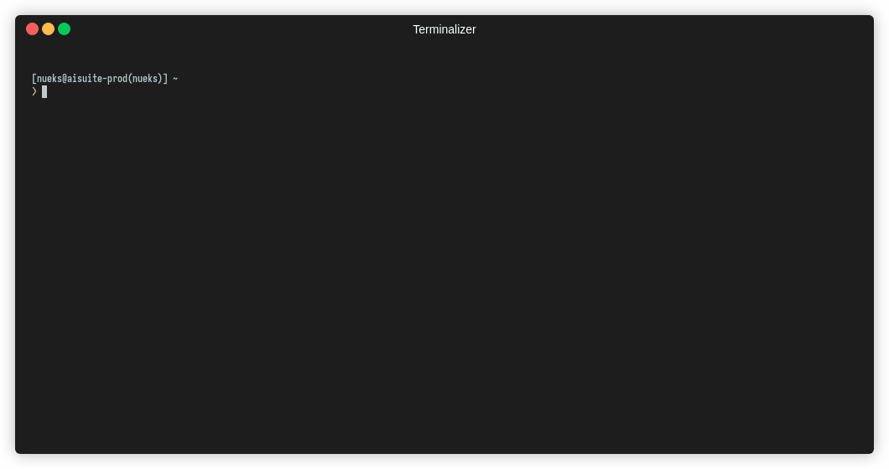

## kubectl context

Interactive kubectl context switcher

### Install
Copy this script to `$PATH`

### Usage


### Tips
Use multiple kubectl files

```sh
$ export KUBECONFIG=<1st config file>:<2nd config file>
```

#### example
```sh
$ tree .kube/cfg
.kube/cfg
├── 00-current
├── admin@aisuite-dev
├── admin@aisuite-prod
├── admin@csr1
├── admin@ncloud
├── ai-infra@citrus
├── nueks@aisuite-prod
└── nueks@ncloud
```

```sh
$ cat .kube/cfg/00-current
apiVersion: v1
kind: Config
```

```sh
$ export KUBECONFIG=$(ls ~/.kube/cfg/* | xargs | tr ' ' ':')

$ kubectl config get-contexts
CURRENT   NAME                 CLUSTER        AUTHINFO             NAMESPACE
          admin@aisuite-dev    aisuite-dev    admin@aisuite-dev
          admin@aisuite-prod   aisuite-prod   admin@aisuite-prod
          admin@csr1           csr1           admin@csr1           default
          admin@ncloud         ncloud         admin@ncloud
          ai-infra@citrus      citrus         ai-infra             ai-infra
          nueks@aisuite-prod   aisuite-prod   nueks@aisuite-prod   nueks
*         nueks@ncloud         ncloud         nueks@ncloud         nueks
```


### References
- https://github.com/ahmetb/kubectx
- https://www.bughunter2k.de/blog/cursor-controlled-selectmenu-in-bash
